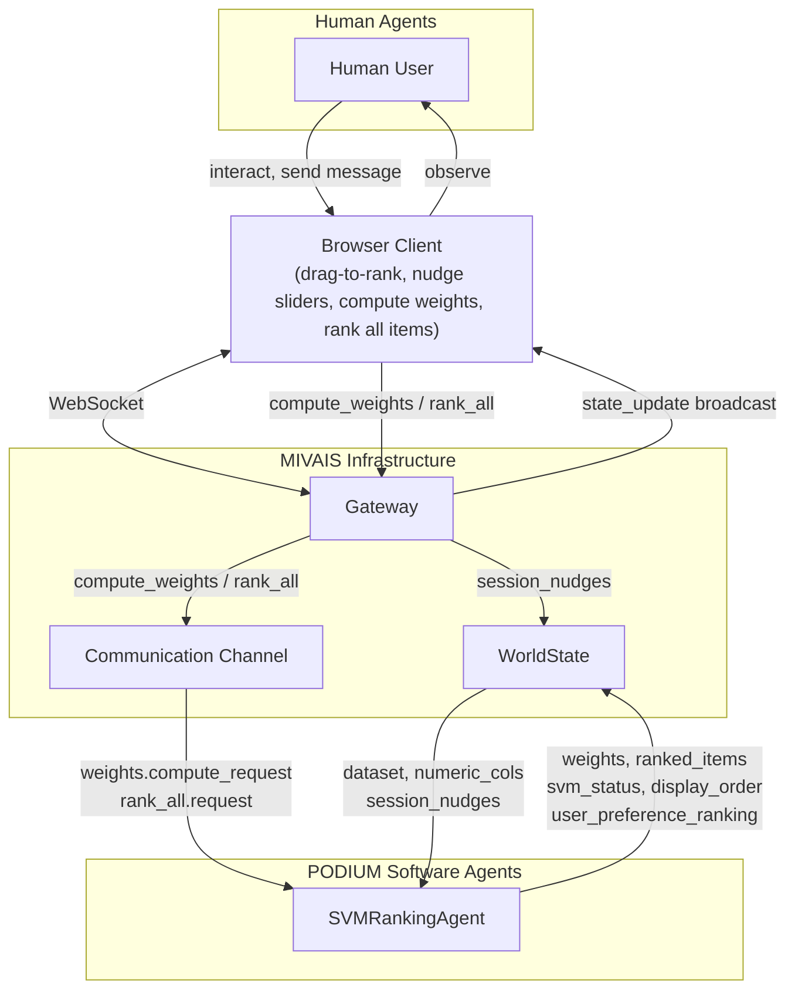
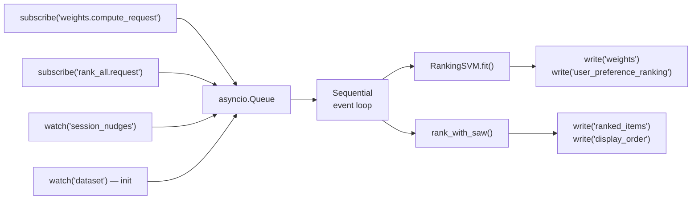

# Example: PODIUM

This page shows an implementation of **PODIUM** (**P**reference-**O**riented **D**ecisions **I**n a **U**ser-driven **M**ixed-initiative system) built on top of MIVAIS. PODIUM is a mixed-initiative visual analytics application where users rank multi-attribute items (e.g. cars) by expressing preferences through a drag-to-rank interface. A software agent powered by a Support Vector Machine learns importance weights from those preferences and, by using a Simple Additive Weighting algorithm, applies the weights to rank the full dataset. The human user can request updating the importance weights and rank all items from the software agent via the communication channel.

## System Design



### WorldState Keys

| Key | Written by | Read by | Description |
|---|---|---|---|
| `dataset` | system (startup) | SVMRankingAgent | Full item records |
| `numeric_cols` | system (startup) | SVMRankingAgent | Attribute column names |
| `user_preference_ranking` | SVMRankingAgent | Studio / observers | Last drag-to-rank ordering the agent fit on |
| `session_nudges` | PodiumGateway (user) | SVMRankingAgent | Per-attribute nudge values |
| `weights` | SVMRankingAgent | Gateway / frontend | Learned attribute weights |
| `ranked_items` | SVMRankingAgent | Gateway / frontend | Sorted item list with scores |
| `display_order` | SVMRankingAgent | Gateway / frontend | Item name order for UI |
| `svm_status` | SVMRankingAgent | Gateway / frontend | Status message for UI |

### MessageBus Topics

| Topic | Publisher | Subscribers |
|---|---|---|
| `weights.compute_request` | PodiumGateway (user) | SVMRankingAgent |
| `rank_all.request` | PodiumGateway (user) | SVMRankingAgent |
| `chat.message` | users | Gateway (→ all connected clients) |

## Step 1 — Configuration

```yaml
users:
  analyst:
    description: Full read/write access
    can_read: []
    can_write:
    - session_nudges
    - display_order
    bus_publish_topics:
    - chat.message
    - weights.compute_request
    - rank_all.request
    bus_subscribe_topics:
    - chat.message
  observer:
    description: Read-only access
    can_read: []
    can_write: []
    bus_publish_topics: []
    bus_subscribe_topics:
    - chat.message
agents:
- agent_id: svm_ranker
  role: ranker
  description: Fits RankSVM on user preferences and ranks all items with SAW
  enabled: true
  class: agents.svm_ranking_agent.SVMRankingAgent
  trigger: watch
  can_read:
  - dataset
  - numeric_cols
  - session_nudges
  can_write:
  - ranked_items
  - weights
  - svm_status
  - display_order
  - user_preference_ranking
  bus_publish_topics: []
  bus_subscribe_topics:
  - weights.compute_request
  - rank_all.request
  params:
    C: 1.0
```

## Step 2 — Gateway

The `Gateway` handles the three PODIUM-specific user actions by overriding `_handle_action()`. Large keys (`dataset` and `numeric_cols`) are excluded from live state updates since they never change after startup.

```python
# podium_gateway.py
from mivais import Gateway

class PodiumGateway(Gateway):
    """
    PODIUM-specific Gateway subclass.

    Adds three domain actions on top of the built-in ones:
      compute_weights  — user submitted a drag-to-rank ordering
      set_nudges       — user adjusted per-attribute nudge sliders
      rank_all         — user triggered a full re-ranking
      drop_order       — user committed a manual reorder of the display
    """

    # Exclude large, startup-only keys from every state_update broadcast.
    # They are still included in the initial_state message on connect.
    _broadcast_exclude_keys = frozenset({"dataset", "numeric_cols"})

    async def _handle_action(self, agent_id: str, session_id: str, data: dict) -> None:
        action = data.get("action")

        if action == "compute_weights":
            # User submitted a ranked list of item indices (drag-to-rank).
            # Sent to SVMRankingAgent through the MessageBus, not WorldState.
            ranking = data.get("ranking", [])
            if len(ranking) >= 2:
                await self._bus.publish(
                    agent_id,
                    "weights.compute_request",
                    {"ranking": [int(i) for i in ranking]},
                )

        elif action == "set_nudges":
            # User adjusted nudge sliders (+1 boost, -1 penalise, 0 neutral)
            raw: dict = data.get("nudges", {})
            nudges = {
                str(k): int(v)
                for k, v in raw.items()
                if isinstance(v, (int, float)) and int(v) in {-1, 0, 1}
            }
            # Remove zeros — they carry no preference signal
            nudges = {k: v for k, v in nudges.items() if v != 0}
            self._ws.write(agent_id, "session_nudges", nudges, event_type="user_input")

        elif action == "rank_all":
            # Sent to SVMRankingAgent through the MessageBus, not WorldState.
            await self._bus.publish(agent_id, "rank_all.request", {})

        elif action == "drop_order":
            # User committed a manual reorder of the visible list
            order = data.get("display_order", [])
            if isinstance(order, list) and len(order) >= 2:
                self._ws.write(
                    agent_id, "display_order",
                    [str(n) for n in order],
                    event_type="user_input",
                )
```

## Step 3 — SVMRankingAgent

The ranker watches two WorldState keys and subscribes to two MessageBus topics. All four sources feed into a single `asyncio.Queue` so events are processed sequentially — no concurrent SVM calls.



```python
# agents/svm_ranking_agent.py
import asyncio
from typing import Any
import numpy as np
import pandas as pd
from mivais import BaseAgent
from podium.ranking_svm import RankingSVM
from podium.saw import rank_with_saw


class SVMRankingAgent(BaseAgent):

    def __init__(self, agent_id, world_state, message_bus, params=None):
        super().__init__(agent_id, world_state, message_bus, params)
        self._svm = RankingSVM(C=self.params.get("C", 1.0))
        self._fitted = False

    async def run(self) -> None:
        self._queue: asyncio.Queue[tuple[str, Any]] = asyncio.Queue()

        # Both watches feed into the same queue as the bus subscriptions
        async def on_nudges(key, value):  await self._queue.put(("apply_nudges", value))
        async def on_dataset(key, value): await self._queue.put(("init_rank", value))

        self._ws.watch("session_nudges", on_nudges)
        self._ws.watch("dataset",        on_dataset)

        self._subscribe("weights.compute_request")
        self._subscribe("rank_all.request")

        # Produce an initial uniform-weight ranking at startup
        await self._queue.put(("init_rank", None))

        while True:
            try:
                event_type, payload = await self._queue.get()
                await self._dispatch(event_type, payload)
            except asyncio.CancelledError:
                break
            except Exception as exc:
                print(f"[{self.agent_id}] error: {exc}")
                await asyncio.sleep(1)

    async def on_message(self, message: dict) -> None:
        topic = message.get("topic")
        payload = message.get("payload") or {}
        if topic == "weights.compute_request":
            await self._queue.put(("fit_svm", payload))
        elif topic == "rank_all.request":
            await self._queue.put(("rank_all", payload))

    async def _dispatch(self, event_type: str, payload: Any) -> None:
        dataset      = self._read("dataset", [])
        numeric_cols = self._read("numeric_cols", [])
        if not dataset or not numeric_cols:
            return

        df = pd.DataFrame(dataset)
        X  = df[numeric_cols].values.astype(float)

        if event_type == "init_rank":
            await self._init_and_rank(df, X, numeric_cols)
        elif event_type == "fit_svm":
            await self._fit_svm(X, numeric_cols, payload)
        elif event_type == "rank_all":
            await self._rank_all(df, X, numeric_cols)
        elif event_type == "apply_nudges":
            await self._apply_nudges(df, X, numeric_cols, payload)

    async def _init_and_rank(self, df, X, cols) -> None:
        if not self._fitted:
            self._svm.feature_names = cols
            self._svm.weights = np.ones(len(cols)) / len(cols)
            self._svm.scaler.fit(X)
            self._fitted = True
        self._write("weights", self._svm._weights_as_dict())
        self._write("svm_status", {"status": "initialised",
                                   "message": "Uniform weights — drag items to express preferences."})
        ranked_df = rank_with_saw(df, cols, self._svm._weights_as_dict())
        self._write("ranked_items", ranked_df.to_dict(orient="records"))
        self._write("display_order", list(ranked_df.iloc[:, 0]))

    async def _fit_svm(self, X, cols, payload) -> None:
        ranking = (payload or {}).get("ranking", [])
        if len(ranking) < 2:
            self._write("svm_status", {"status": "pending",
                                       "message": "Need at least 2 items ranked."})
            return
        if not self._fitted:
            self._svm.feature_names = cols
            self._svm.scaler.fit(X)
            self._fitted = True
        weights_dict = self._svm.fit(X, ranking, cols)
        nudges = self._read("session_nudges", {})
        if nudges:
            weights_dict = self._svm.apply_nudges(nudges)
        self._write("user_preference_ranking", {"ranking": ranking})
        self._write("weights", weights_dict)
        self._write("svm_status", {"status": "fitted",
                                   "message": f"SVM fitted on {len(ranking)} items. Click Rank All to apply."})

    async def _rank_all(self, df, X, cols) -> None:
        if not self._fitted:
            await self._init_and_rank(df, X, cols)
            return
        weights_dict = self._svm._weights_as_dict()
        ranked_df    = rank_with_saw(df, cols, weights_dict)
        self._write("ranked_items", ranked_df.to_dict(orient="records"))
        self._write("display_order", list(ranked_df.iloc[:, 0]))
        self._write("svm_status", {"status": "ranked",
                                   "message": f"Ranked {len(ranked_df)} items."})

    async def _apply_nudges(self, df, X, cols, nudges) -> None:
        if not self._fitted:
            self._svm.feature_names = cols
            self._svm.weights = np.ones(len(cols)) / len(cols)
            self._svm.scaler.fit(X)
            self._fitted = True
        weights_dict = self._svm.apply_nudges(nudges) if nudges else self._svm._weights_as_dict()
        self._write("weights", weights_dict)
        ranked_df = rank_with_saw(df, cols, weights_dict)
        self._write("ranked_items", ranked_df.to_dict(orient="records"))
        self._write("display_order", list(ranked_df.iloc[:, 0]))
        self._write("svm_status", {"status": "nudged", "message": f"Nudges applied: {nudges}"})
```

::: info Why asyncio.Queue?
Without the queue, three concurrent `write()` calls could trigger three overlapping SVM fits simultaneously. The queue serialises them into a single sequential loop — the agent is always computing at most one ranking at a time.
:::

## Step 5 — Application Entry Point

```python
# main.py
import asyncio
import importlib
import json
from contextlib import asynccontextmanager
from pathlib import Path

import pandas as pd
from fastapi import FastAPI, WebSocket, WebSocketDisconnect, Query
from fastapi.middleware.cors import CORSMiddleware
from fastapi.responses import JSONResponse

from mivais import (
    AuditLog, AgentRegistry, AgentCapabilities,
    PermissionGuard, WorldState, MessageBus, SessionRecorder,
)
from podium_gateway import PodiumGateway

CONFIG_PATH  = Path("agents_config.yaml")
DATASET_PATH = Path("data/cars.csv")
RECORDINGS   = Path("recordings")

_agent_tasks: list[asyncio.Task] = []


def _load_config() -> dict:
    return json.loads(CONFIG_PATH.read_text())


@asynccontextmanager
async def lifespan(app: FastAPI):
    config = _load_config()

    # 1. Construct infrastructure
    audit    = AuditLog()
    registry = AgentRegistry()
    guard    = PermissionGuard(registry)
    state    = WorldState(audit, guard)
    bus      = MessageBus(audit)
    recorder = SessionRecorder(RECORDINGS)
    gateway  = PodiumGateway(
        state, audit, registry, bus,
        user_configs=config["users"],
        recorder=recorder,
    )

    # 2. Load dataset
    df = pd.read_csv(DATASET_PATH)
    numeric_cols = [c for c in df.columns if c != "name"]
    state.system_write("dataset",                  df.to_dict(orient="records"))
    state.system_write("numeric_cols",             numeric_cols)
    state.system_write("session_nudges",           {})
    state.system_write("user_preference_ranking",  {})
    state.system_write("ranked_items",             [])
    state.system_write("display_order",            [])
    state.system_write("weights",                  {})
    state.system_write("svm_status",               {"status": "initialised"})

    # 3. Register and start agents
    for agent_cfg in config["agents"]:
        if not agent_cfg.get("enabled", True):
            continue
        module_path, class_name = agent_cfg["class"].rsplit(".", 1)
        AgentClass = getattr(importlib.import_module(module_path), class_name)
        caps = AgentCapabilities(
            agent_id=agent_cfg["agent_id"],
            role=agent_cfg["role"],
            description=agent_cfg.get("description", ""),
            can_read=agent_cfg.get("can_read", []),
            can_write=agent_cfg.get("can_write", []),
            bus_publish_topics=agent_cfg.get("bus_publish_topics", []),
            bus_subscribe_topics=agent_cfg.get("bus_subscribe_topics", []),
            params=agent_cfg.get("params", {}),
        )
        instance = AgentClass(caps.agent_id, state, bus, caps.params)
        registry.register(caps, instance)
        _agent_tasks.append(asyncio.create_task(instance.run()))

    gateway.set_online_agents([
        {"agent_id": a["agent_id"], "role": a.get("role", ""), "description": a.get("description", "")}
        for a in config["agents"] if a.get("enabled", True)
    ])

    app.state.gateway  = gateway
    app.state.state    = state
    app.state.audit    = audit
    app.state.registry = registry
    app.state.recorder = recorder

    yield

    for t in _agent_tasks:
        t.cancel()
    await asyncio.gather(*_agent_tasks, return_exceptions=True)
    recorder.close()


app = FastAPI(title="PODIUM", lifespan=lifespan)
app.add_middleware(CORSMiddleware, allow_origins=["*"], allow_methods=["*"], allow_headers=["*"])


@app.websocket("/ws/{session_id}")
async def ws_endpoint(
    websocket: WebSocket,
    session_id: str,
    role: str = Query(default="analyst"),
):
    gw: PodiumGateway = app.state.gateway
    await gw.connect(session_id, websocket, role=role)
    try:
        while True:
            raw = await websocket.receive_text()
            await gw.receive_and_apply(session_id, raw)
    except WebSocketDisconnect:
        await gw.disconnect(session_id)


@app.get("/state")
def get_state():
    snapshot = app.state.state.snapshot()
    return {k: v for k, v in snapshot.items() if k not in {"dataset", "numeric_cols"}}

@app.get("/audit")
def get_audit():
    return JSONResponse({"entries": app.state.audit.get_all()})

@app.get("/agents")
def get_agents():
    return {"agents": app.state.registry.summary()}
```

## Frontend Protocol

The frontend communicates with the application over WebSocket. Here is the complete message protocol for PODIUM.

### Outgoing (frontend → server)

```js
// Express a ranked preference (drag-to-rank)
ws.send(JSON.stringify({
    action: "compute_weights",
    ranking: [2, 0, 4, 1, 3]  // item indices, best-first
}))

// Adjust attribute nudges
ws.send(JSON.stringify({
    action: "set_nudges",
    nudges: { mpg: 1, horsepower: -1 }  // +1 boost, -1 penalise
}))

// Trigger full re-ranking with current weights
ws.send(JSON.stringify({ action: "rank_all" }))

// Commit a manual reorder of the display
ws.send(JSON.stringify({
    action: "drop_order",
    display_order: ["Toyota Corolla", "Honda Civic", ...]
}))

// Send a chat message (analyst role only)
ws.send(JSON.stringify({
    action: "chat_message",
    text: "I prefer fuel-efficient cars",
    to: "broadcast"
}))

// Track cursor position (built-in Gateway action)
ws.send(JSON.stringify({
    action: "cursor_move",
    row_name: "Toyota Corolla",
    x: 0.42,
    y: 0.61
}))
```

### Incoming (server → frontend)

```js
ws.onmessage = (event) => {
    const msg = JSON.parse(event.data)

    if (msg.type === "initial_state") {
        // Full snapshot + permissions on first connect
        initUI(msg.world_state.dataset)
        applyState(msg.world_state)
        myRole = msg.my_permissions.role
        writeableKeys = msg.my_permissions.can_write
        chatHistory = msg.chat_history
    }

    else if (msg.type === "state_update") {
        // Incremental update after any write (no dataset — excluded)
        applyState(msg.world_state)   // ranked_items, weights, svm_status...
        updateAuditLog(msg.audit_log)
        updatePresence(msg.connected_users)
        updateCursors(msg.cursors)
    }

    else if (msg.type === "cursor_update") {
        // Lightweight cursor-only update (no state, no audit)
        updatePresence(msg.connected_users)
        updateCursors(msg.cursors)
    }

    else if (msg.type === "bus_message") {
        // A bus message delivered to this client's subscribed topics
        const { sender, topic, payload } = msg.message
        if (topic === "chat.message") {
            appendChatMessage(payload)
        }
    }
}
```

## What PODIUM Demonstrates

Working through the PODIUM implementation highlights several MIVAIS patterns:

**The asyncio.Queue pattern.** `SVMRankingAgent` observes two WorldState keys and two MessageBus topics but processes events one at a time. Without the queue, rapid user interactions could trigger concurrent SVM fits. The queue decouples event arrival from event processing.

**Communication Channel for triggering compute weights / rank all.** As messages across agents do not update the WorldState by design, the request to update attribute weights and to re-rank all items is sent directly to `SVMRankingAgent` through the Communication Channel (`weights.compute_request` / `rank_all.request`), not by writing a WorldState key. `SVMRankingAgent` writes the resulting `user_preference_ranking` back to WorldState itself, as part of the state its own computation affects.

**`_broadcast_exclude_keys`.** The `dataset` and `numeric_cols` keys are loaded once at startup and never change. Broadcasting them on every state update would re-transmit hundreds of kilobytes per interaction. By listing them in `_broadcast_exclude_keys`, they are sent only once in `initial_state`.

**Users as agents.** An `analyst` user who submits a `compute_weights` request is registered as `user:<session_id>` with `bus_publish_topics: ["weights.compute_request", "rank_all.request", ...]`. The publish goes through the MessageBus identically to any agent publish. The AuditLog records the sender as `user:<session_id>`, not as a generic "user". A multi-user session with two analysts produces an audit trail that attributes every preference expression to its specific session.
