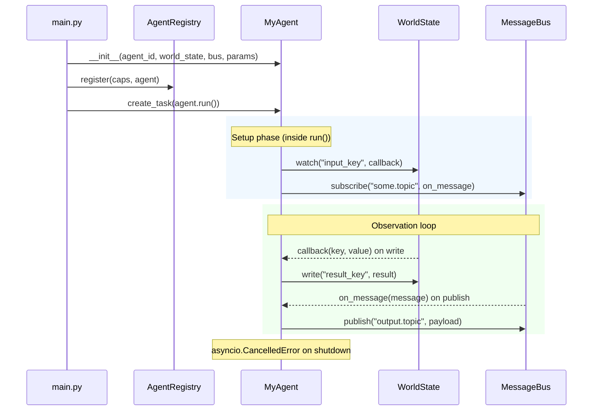
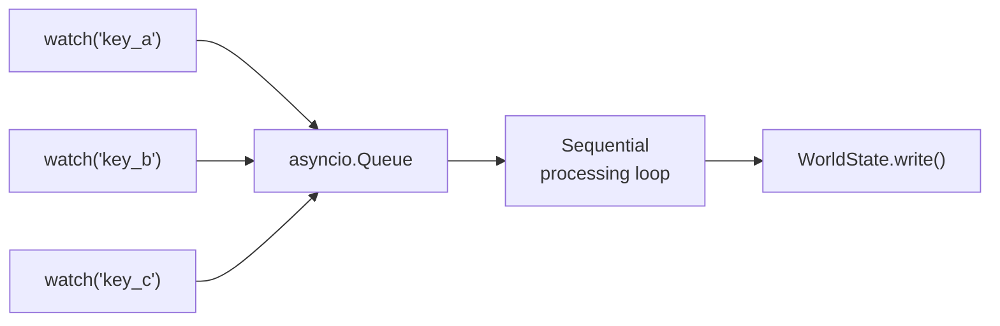

# Agent Lifecycle

This page describes how to implement agents using the `BaseAgent` abstract class and how they integrate with the MIVAIS infrastructure.

## Lifecycle Overview



## Implementing an Agent

Every agent must extend `BaseAgent` and implement the `run()` coroutine:

```python
from mivais import BaseAgent
import asyncio
from typing import Any

class MyAgent(BaseAgent):
    async def run(self) -> None:
        # 1. Set up watchers and subscriptions during the setup phase
        self._ws.watch("input_key", self._on_input)
        self._subscribe("some.topic")

        # 2. Keep the coroutine alive — the event loop handles the rest
        try:
            await asyncio.get_event_loop().create_future()
        except asyncio.CancelledError:
            pass  # clean shutdown

    async def _on_input(self, key: str, value: Any) -> None:
        result = process(value)
        accepted = self._write("result_key", result)

    async def on_message(self, message: dict) -> None:
        # React to bus messages on subscribed topics
        payload = message.get("payload", {})
```

## Observation Strategies

### Watch — Event-Driven

Register async callbacks on WorldState keys using `self._ws.watch()`. The callback fires after every accepted write to that key.

```python
async def run(self) -> None:
    self._ws.watch("trigger_key", self._on_trigger)
    await asyncio.get_event_loop().create_future()
```

**When to use:** The agent only needs to react to specific state changes. This is the preferred strategy — the agent consumes no CPU while waiting.

#### Handling multiple triggers with a queue

When several keys should trigger the same computation, use an `asyncio.Queue` to serialise events and avoid concurrent processing:



```python
class MultiWatchAgent(BaseAgent):
    def __init__(self, *args, **kwargs):
        super().__init__(*args, **kwargs)
        self._queue: asyncio.Queue = asyncio.Queue()

    async def run(self) -> None:
        self._ws.watch("key_a", self._enqueue)
        self._ws.watch("key_b", self._enqueue)
        while True:
            try:
                key, value = await self._queue.get()
                await self._process(key, value)
            except asyncio.CancelledError:
                break

    async def _enqueue(self, key: str, value: Any) -> None:
        await self._queue.put((key, value))

    async def _process(self, key: str, value: Any) -> None:
        a = self._read("key_a")
        b = self._read("key_b")
        self._write("output_key", compute(a, b))
```

### Poll — Time-Driven

Poll WorldState on a fixed interval using `self._sleep()`. Use this when the agent produces periodic outputs regardless of state changes.

```python
async def run(self) -> None:
    interval = self.params.get("poll_interval_seconds", 5.0)
    while True:
        try:
            value = self._read("some_key")
            if value is not None:
                self._write("summary", summarise(value))
            await self._sleep(interval)
        except asyncio.CancelledError:
            break
```

`self._sleep()` raises `asyncio.CancelledError` on shutdown, which cleanly terminates the loop.

## Error Handling

The `run()` coroutine must never die silently. Wrap processing methods in try/except:

```python
async def _on_input(self, key: str, value: Any) -> None:
    try:
        result = process(value)
        self._write("output_key", result)
    except Exception as exc:
        print(f"[{self.agent_id}] error: {exc}")
        self._write("agent_status", {"error": str(exc)})
```

## Using Parameters

Agent-specific configuration comes from the `"params"` field in the config file, accessible as `self.params`:

```python
class ThresholdAgent(BaseAgent):
    async def run(self) -> None:
        self._threshold = float(self.params.get("threshold", 0.5))
        self._ws.watch("score", self._on_score)
        await asyncio.get_event_loop().create_future()

    async def _on_score(self, key: str, value: float) -> None:
        if value > self._threshold:
            await self._publish("alert.high_score", {"score": value})
```

## Startup and Registration

```python
agent = MyAgent(
    agent_id="my_agent",
    world_state=state,
    message_bus=bus,
    params={"threshold": 0.75},
)
registry.register(caps, agent)
task = asyncio.create_task(agent.run())
```

The agent's capabilities (permissions, topics) are declared separately in the `AgentCapabilities` object. The agent itself does not need to know about its own permissions — the PermissionGuard enforces them transparently.

## Shutdown

On application shutdown, cancel all agent tasks:

```python
for task in tasks:
    task.cancel()
await asyncio.gather(*tasks, return_exceptions=True)
```

This raises `asyncio.CancelledError` inside `run()`, terminating the loop. Agents should not perform any cleanup in response to cancellation.

## BaseAgent API Reference

See [BaseAgent](/api/base-agent) for the complete API reference.
