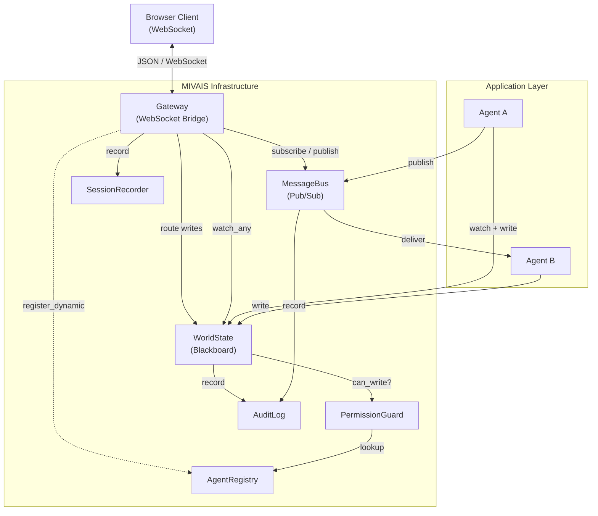
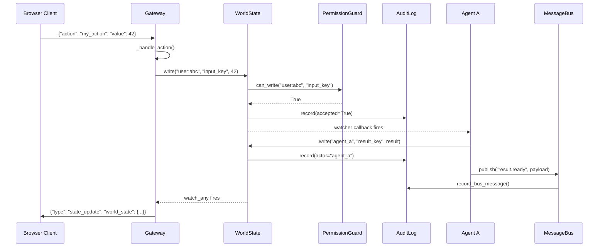
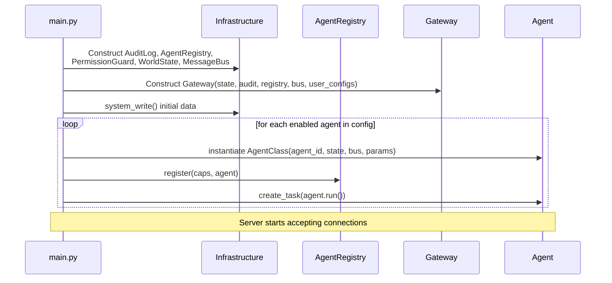

# Architecture

## System Overview

MIVAIS organises a mixed-initiative system around a central blackboard (`WorldState`) that all participants — human users and autonomous agents alike — read from and write to. A permission layer intercepts every write. A message bus provides a separate channel for typed, event-driven communication that does not go through state. A WebSocket gateway bridges the infrastructure to browser clients. An audit log records everything.

## Request Lifecycle

The following sequence shows what happens when a user submits an action from the browser, an agent reacts, and the result is broadcast back.

## Component Responsibilities

### WorldState

The central blackboard. Every piece of data shared between participants lives here. Agents register async watchers on specific keys; the WorldState notifies them after every accepted write. The Gateway registers a global watcher that fires on every write to push state updates to connected clients.

Reads are unrestricted at the `get()` level. Permission filtering is applied by `snapshot_for()`, which returns only the keys the requesting agent is permitted to see.

### MessageBus

A typed, async publish/subscribe channel. Agents publish messages on named topics; other agents — or the Gateway — subscribe to those topics. The bus logs every message to the AuditLog. Agents never know who else is subscribed. Delivery is fire-and-forget: the publisher does not wait for subscribers to process the message.

The bus is complementary to WorldState. Use WorldState for persistent, readable state. Use the bus for transient notifications and typed events.

### AgentRegistry

The single source of truth for registered participants. Stores `AgentCapabilities` for every agent (including users, registered dynamically on connect) and holds references to running agent instances. The PermissionGuard consults the registry on every write and topic access.

### PermissionGuard

Enforces the permission model declared in the configuration file. Consulted on every `WorldState.write()`, `MessageBus.publish()`, and `MessageBus.subscribe()` call. Unknown agents are denied by default. The model is asymmetric:

- `can_read = []` → the agent may read all keys (permissive default).
- `can_write = []` → the agent may write nothing (restrictive default).

### AuditLog

An append-only log of every write attempt and every bus message. Entries are never removed. Every entry carries an actor, a key or topic, a value representation, a timestamp, an accepted/denied flag, and an event type. The AuditLog is the canonical record of everything that happened in a session.

### Gateway

The network boundary of the infrastructure. It accepts WebSocket connections, registers each user as an agent in the registry, and forwards incoming JSON messages — either to built-in handlers (cursor tracking, chat, bus publishing) or to the `_handle_action()` hook that application code overrides. On every WorldState write, it broadcasts the updated state to all connected clients.

The Gateway is the only component that knows about the network. Infrastructure components never send data to clients directly.

### SessionRecorder

Writes every event to a JSONL file. The format is designed for independent line parsing, making seek and replay efficient. The full initial snapshot (including any large datasets) is written once; subsequent state updates omit keys listed in `_broadcast_exclude_keys`.

### BaseAgent

The abstract base class all agents must extend. Provides convenience helpers (`_read`, `_write`, `_publish`, `_subscribe`) that route through WorldState and MessageBus. Agents receive only `WorldState` and `MessageBus` at construction — never the full infrastructure, the Gateway, or other agents.

## Startup Sequence

A typical startup proceeds in this order:

## Design Invariants

These invariants hold throughout the lifetime of a MIVAIS application:

- No agent holds a reference to another agent.
- No component calls a method on the Gateway directly (the Gateway subscribes to WorldState and the bus).
- Every write to WorldState is permission-checked; there is no way to bypass the guard at application level (only `system_write()` bypasses, and it is logged with `actor="system"`).
- The AuditLog has no `clear()` method.
- BaseAgent implementations receive only `WorldState` and `MessageBus` at construction.
