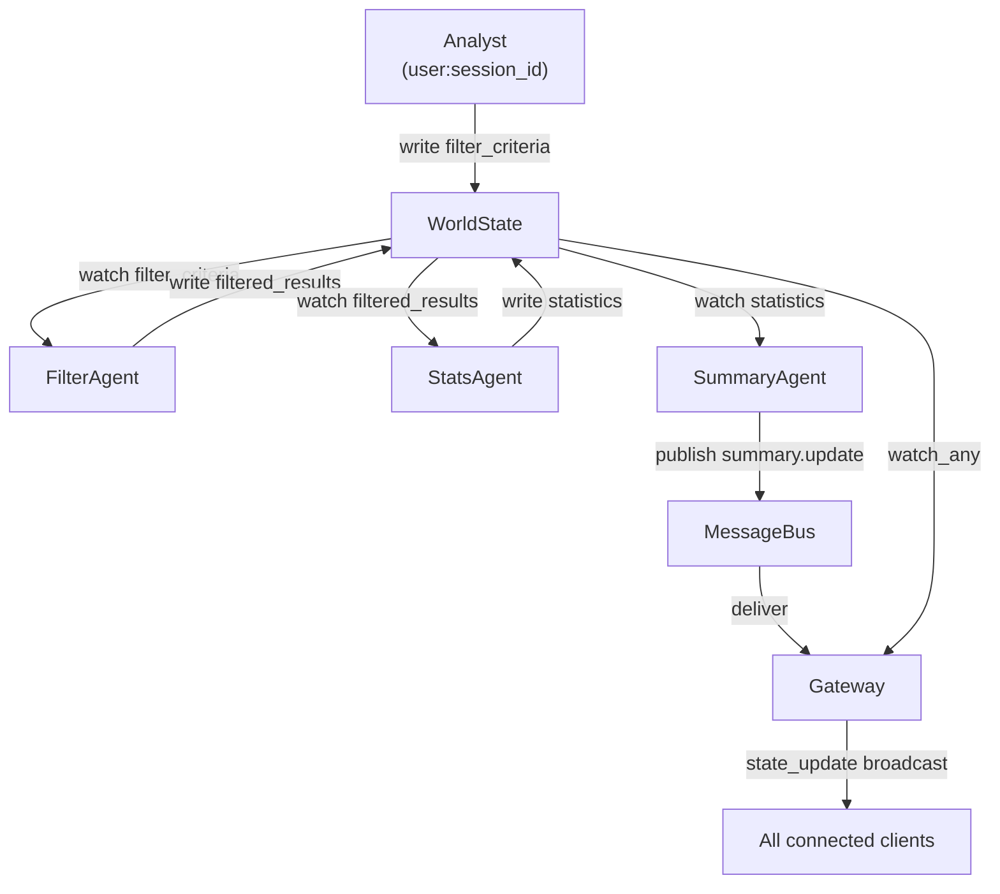

# Building a System

This guide builds a complete MIVAIS application from scratch. By the end, you will have a running backend with multiple autonomous agents, two user roles, real-time WebSocket state delivery, and a full audit trail.

The domain is deliberately simple so that the infrastructure patterns stay in focus.

## What We Are Building

A **collaborative data exploration dashboard**. Multiple users can connect simultaneously. Analysts submit filter criteria; a `FilterAgent` processes the data and writes filtered results; a `StatsAgent` computes descriptive statistics from those results; a `SummaryAgent` publishes a human-readable commentary whenever the statistics change.



### WorldState keys

| Key | Written by | Description |
|---|---|---|
| `dataset` | system (startup) | Full dataset, loaded once |
| `filter_criteria` | Analyst user | Active filter submitted from frontend |
| `filtered_results` | FilterAgent | Rows matching current filter |
| `statistics` | StatsAgent | Descriptive stats over filtered results |

### MessageBus topics

| Topic | Publisher | Delivered to |
|---|---|---|
| `summary.update` | SummaryAgent | All connected analyst and observer clients |

## Project Layout

```
my_app/
├── main.py
├── agents_config.yaml
├── app_gateway.py
└── agents/
    ├── filter_agent.py
    ├── stats_agent.py
    └── summary_agent.py
```

Copy the `mivais/` directory into your project root.

## Step 1 — Configuration

`agents_config.yaml` is the single file that declares all permissions. Nothing in the Python code should hardcode who can read or write what.

```yaml
users:
  analyst:
    description: Can submit filter criteria and view all results
    can_read: []
    can_write:
    - filter_criteria
    bus_publish_topics: []
    bus_subscribe_topics:
    - summary.update
  observer:
    description: Read-only access
    can_read: []
    can_write: []
    bus_publish_topics: []
    bus_subscribe_topics:
    - summary.update
agents:
- agent_id: filter_agent
  role: processor
  description: Filters the dataset according to current criteria
  enabled: true
  class: agents.filter_agent.FilterAgent
  trigger: watch
  can_read:
  - dataset
  - filter_criteria
  can_write:
  - filtered_results
  bus_publish_topics: []
  bus_subscribe_topics: []
  params: {}
- agent_id: stats_agent
  role: processor
  description: Computes descriptive statistics over the filtered results
  enabled: true
  class: agents.stats_agent.StatsAgent
  trigger: watch
  can_read:
  - filtered_results
  can_write:
  - statistics
  bus_publish_topics: []
  bus_subscribe_topics: []
  params: {}
- agent_id: summary_agent
  role: advisor
  description: Publishes a human-readable summary when statistics change
  enabled: true
  class: agents.summary_agent.SummaryAgent
  trigger: watch
  can_read:
  - statistics
  can_write: []
  bus_publish_topics:
  - summary.update
  bus_subscribe_topics: []
  params: {}
```

::: info Permission model at a glance
An analyst with `can_write: ["filter_criteria"]` cannot write `filtered_results` — that key belongs to `FilterAgent`. `StatsAgent` cannot write `filter_criteria` — it only writes `statistics`. The `SummaryAgent` writes nothing to state; it only publishes on the bus.
:::

## Step 2 — Agents

### FilterAgent

Watches `filter_criteria`. When a new value is written, it applies the filter to the dataset and writes `filtered_results`.

```python
# agents/filter_agent.py
import asyncio
from typing import Any
from mivais import BaseAgent


class FilterAgent(BaseAgent):

    async def run(self) -> None:
        # Watch the key that triggers this agent's work.
        # The callback fires after every accepted write on "filter_criteria".
        self._ws.watch("filter_criteria", self._on_criteria_changed)
        await asyncio.get_event_loop().create_future()

    async def _on_criteria_changed(self, key: str, criteria: Any) -> None:
        try:
            dataset = self._read("dataset", [])
            results = self._apply_filter(dataset, criteria)
            self._write("filtered_results", results)
        except Exception as exc:
            print(f"[{self.agent_id}] error: {exc}")

    def _apply_filter(self, dataset: list[dict], criteria: dict) -> list[dict]:
        if not criteria:
            return dataset
        column = criteria.get("column")
        value  = criteria.get("value")
        op     = criteria.get("op", "eq")
        if not column or value is None:
            return dataset
        ops = {
            "eq":  lambda row: row.get(column) == value,
            "gt":  lambda row: row.get(column, 0) > value,
            "lt":  lambda row: row.get(column, 0) < value,
            "gte": lambda row: row.get(column, 0) >= value,
            "lte": lambda row: row.get(column, 0) <= value,
        }
        predicate = ops.get(op, ops["eq"])
        return [row for row in dataset if predicate(row)]
```

### StatsAgent

Watches `filtered_results`. Computes basic statistics and writes them to `statistics`.

```python
# agents/stats_agent.py
import asyncio
from typing import Any
from mivais import BaseAgent


class StatsAgent(BaseAgent):

    async def run(self) -> None:
        self._ws.watch("filtered_results", self._on_results_changed)
        await asyncio.get_event_loop().create_future()

    async def _on_results_changed(self, key: str, results: Any) -> None:
        try:
            if not results:
                self._write("statistics", {"count": 0})
                return
            numeric_keys = [
                k for k in results[0].keys()
                if isinstance(results[0][k], (int, float))
            ]
            stats: dict = {"count": len(results)}
            for k in numeric_keys:
                values = [row[k] for row in results if isinstance(row.get(k), (int, float))]
                if values:
                    stats[k] = {
                        "min":  min(values),
                        "max":  max(values),
                        "mean": sum(values) / len(values),
                    }
            self._write("statistics", stats)
        except Exception as exc:
            print(f"[{self.agent_id}] error: {exc}")
```

### SummaryAgent

Watches `statistics`. Publishes a natural-language message on `summary.update` whenever the statistics change. Note that this agent has `can_write: []` — it deliberately cannot write to WorldState. Its only output is through the bus.

```python
# agents/summary_agent.py
import asyncio
from typing import Any
from mivais import BaseAgent


class SummaryAgent(BaseAgent):

    async def run(self) -> None:
        self._ws.watch("statistics", self._on_statistics_changed)
        await asyncio.get_event_loop().create_future()

    async def _on_statistics_changed(self, key: str, stats: Any) -> None:
        try:
            if not stats:
                return
            summary = self._build_summary(stats)
            await self._publish("summary.update", {"text": summary})
        except Exception as exc:
            print(f"[{self.agent_id}] error: {exc}")

    def _build_summary(self, stats: dict) -> str:
        count = stats.get("count", 0)
        if count == 0:
            return "No rows match the current filter."
        numeric = {k: v for k, v in stats.items() if isinstance(v, dict) and "mean" in v}
        if not numeric:
            return f"{count} rows match the current filter."
        col, values = next(iter(numeric.items()))
        return (
            f"{count} rows match the filter. "
            f"{col}: mean {values['mean']:.2f}, "
            f"range [{values['min']:.2f}, {values['max']:.2f}]."
        )
```

## Step 3 — Gateway Subclass

The built-in `Gateway` handles cursor tracking, chat messages, and bus publishing. Domain-specific actions — in this case, submitting a filter — are added by overriding `_handle_action()`.

```python
# app_gateway.py
from mivais import Gateway


class AppGateway(Gateway):
    """
    Application-specific Gateway.

    Adds one domain action: apply_filter.
    Excludes the dataset from live state_update broadcasts because it
    is large and never changes after startup.
    """

    # The "dataset" key is sent once in initial_state, then excluded from
    # every subsequent state_update to avoid re-transmitting it on each change.
    _broadcast_exclude_keys = frozenset({"dataset"})

    async def _handle_action(self, agent_id: str, session_id: str, data: dict) -> None:
        action = data.get("action")

        if action == "apply_filter":
            criteria = data.get("criteria", {})
            # This write is permission-checked — analyst has "filter_criteria"
            # in can_write; observer does not. PermissionGuard decides.
            self._ws.write(
                agent_id,
                "filter_criteria",
                criteria,
                event_type="user_input",
            )

        elif action == "clear_filter":
            self._ws.write(
                agent_id,
                "filter_criteria",
                {},
                event_type="user_input",
            )
```

## Step 4 — Wiring It Together

`main.py` constructs the infrastructure, loads the configuration, starts each agent, and exposes the WebSocket endpoint.

```python
# main.py
import asyncio
import importlib
import json
from contextlib import asynccontextmanager
from pathlib import Path

from fastapi import FastAPI, WebSocket, WebSocketDisconnect, Query
from fastapi.middleware.cors import CORSMiddleware
from fastapi.responses import JSONResponse

from mivais import (
    AuditLog, AgentRegistry, AgentCapabilities,
    PermissionGuard, WorldState, MessageBus, SessionRecorder,
)
from app_gateway import AppGateway

CONFIG_PATH  = Path("agents_config.yaml")
RECORDINGS   = Path("recordings")

_agent_tasks: list[asyncio.Task] = []


def load_config() -> dict:
    return json.loads(CONFIG_PATH.read_text(encoding="utf-8"))


@asynccontextmanager
async def lifespan(app: FastAPI):
    config = load_config()

    # ── 1. Construct infrastructure ────────────────────────────────────────
    audit    = AuditLog()
    registry = AgentRegistry()
    guard    = PermissionGuard(registry)
    state    = WorldState(audit, guard)
    bus      = MessageBus(audit)
    recorder = SessionRecorder(RECORDINGS)
    gateway  = AppGateway(
        state, audit, registry, bus,
        user_configs=config["users"],
        recorder=recorder,
    )

    # ── 2. Load initial data ───────────────────────────────────────────────
    # system_write bypasses permissions and is intended only for startup.
    dataset = load_your_dataset()          # list[dict] — implement this
    state.system_write("dataset",          dataset)
    state.system_write("filter_criteria",  {})
    state.system_write("filtered_results", dataset)
    state.system_write("statistics",       {})

    # ── 3. Register and start agents ───────────────────────────────────────
    for agent_cfg in config["agents"]:
        if not agent_cfg.get("enabled", True):
            continue

        module_path, class_name = agent_cfg["class"].rsplit(".", 1)
        AgentClass = getattr(importlib.import_module(module_path), class_name)

        caps = AgentCapabilities(
            agent_id             = agent_cfg["agent_id"],
            role                 = agent_cfg["role"],
            description          = agent_cfg.get("description", ""),
            can_read             = agent_cfg.get("can_read", []),
            can_write            = agent_cfg.get("can_write", []),
            bus_publish_topics   = agent_cfg.get("bus_publish_topics", []),
            bus_subscribe_topics = agent_cfg.get("bus_subscribe_topics", []),
            params               = agent_cfg.get("params", {}),
        )
        instance = AgentClass(caps.agent_id, state, bus, caps.params)
        registry.register(caps, instance)
        _agent_tasks.append(asyncio.create_task(instance.run()))

    gateway.set_online_agents([
        {
            "agent_id":    a["agent_id"],
            "role":        a.get("role", ""),
            "description": a.get("description", ""),
        }
        for a in config["agents"] if a.get("enabled", True)
    ])

    app.state.gateway  = gateway
    app.state.state    = state
    app.state.audit    = audit
    app.state.registry = registry

    yield   # ── application runs ──────────────────────────────────────────

    # ── Shutdown ───────────────────────────────────────────────────────────
    for task in _agent_tasks:
        task.cancel()
    await asyncio.gather(*_agent_tasks, return_exceptions=True)
    recorder.close()


app = FastAPI(title="My Analytics App", lifespan=lifespan)
app.add_middleware(
    CORSMiddleware,
    allow_origins=["*"], allow_methods=["*"], allow_headers=["*"],
)


# ── WebSocket endpoint ─────────────────────────────────────────────────────────

@app.websocket("/ws/{session_id}")
async def ws_endpoint(
    websocket: WebSocket,
    session_id: str,
    role: str = Query(default="analyst"),
):
    gw: AppGateway = app.state.gateway
    await gw.connect(session_id, websocket, role=role)
    try:
        while True:
            raw = await websocket.receive_text()
            await gw.receive_and_apply(session_id, raw)
    except WebSocketDisconnect:
        await gw.disconnect(session_id)


# ── REST endpoints ─────────────────────────────────────────────────────────────

@app.get("/state")
def get_state():
    snapshot = app.state.state.snapshot()
    return {k: v for k, v in snapshot.items() if k != "dataset"}

@app.get("/audit")
def get_audit():
    return JSONResponse({"entries": app.state.audit.get_all()})

@app.get("/agents")
def get_agents():
    return {"agents": app.state.registry.summary()}
```

Run with:

```bash
uvicorn main:app --reload
```

## Step 5 — Frontend Integration

Connect to the WebSocket from the browser:

```javascript
const sessionId = crypto.randomUUID()
const ws = new WebSocket(`ws://localhost:8000/ws/${sessionId}?role=analyst`)

ws.onmessage = (event) => {
    const msg = JSON.parse(event.data)

    if (msg.type === "initial_state") {
        // Full snapshot on first connect.
        // Includes my_permissions so the UI knows what the user can do.
        initTable(msg.world_state.dataset)      // show the full dataset
        applyStats(msg.world_state.statistics)
        myWritePermissions = msg.my_permissions.can_write

    } else if (msg.type === "state_update") {
        // Fired after every WorldState write.
        // "dataset" is excluded (set in _broadcast_exclude_keys).
        applyFilteredResults(msg.world_state.filtered_results)
        applyStats(msg.world_state.statistics)
        renderAuditLog(msg.audit_log)
        renderPresence(msg.connected_users)

    } else if (msg.type === "cursor_update") {
        // Lightweight update — no state, no audit, only cursors and presence.
        renderPresence(msg.connected_users)
        renderCursors(msg.cursors)

    } else if (msg.type === "bus_message") {
        // A message from the MessageBus delivered to this client.
        const { topic, payload } = msg.message
        if (topic === "summary.update") {
            showNotification(payload.text)
        }
    }
}

// Submit a filter — routed to AppGateway._handle_action()
function applyFilter(column, op, value) {
    ws.send(JSON.stringify({
        action: "apply_filter",
        criteria: { column, op, value }
    }))
}

// Clear filter
function clearFilter() {
    ws.send(JSON.stringify({ action: "clear_filter" }))
}

// Track cursor position (built-in Gateway action)
function onRowHover(rowId) {
    ws.send(JSON.stringify({ action: "cursor_move", row_name: rowId }))
}
```

## Tracing an Interaction

To make the data flow concrete, here is what happens when an analyst applies a filter:

```
1. Browser sends {"action": "apply_filter", "criteria": {"column": "age", "op": "gt", "value": 30}}

2. Gateway.receive_and_apply()
   → "apply_filter" is not a built-in action
   → AppGateway._handle_action("user:abc", "abc", data)
   → state.write("user:abc", "filter_criteria", {"column": "age", ...}, event_type="user_input")

3. WorldState.write()
   → PermissionGuard.can_write("user:abc", "filter_criteria") → True (analyst role)
   → AuditLog.record(actor="user:abc", key="filter_criteria", accepted=True)
   → state["filter_criteria"] = {"column": "age", "op": "gt", "value": 30}
   → schedule watcher notifications

4. FilterAgent._on_criteria_changed() fires
   → reads dataset, applies filter
   → state.write("filter_agent", "filtered_results", [...])
   → AuditLog.record(actor="filter_agent", key="filtered_results", accepted=True)

5. StatsAgent._on_results_changed() fires
   → computes statistics
   → state.write("stats_agent", "statistics", {...})

6. SummaryAgent._on_statistics_changed() fires
   → builds summary string
   → bus.publish("summary_agent", "summary.update", {"text": "..."})
   → AuditLog.record_bus_message(...)
   → Gateway's subscription receives the message
   → delivered to all clients subscribed to "summary.update"

7. Gateway.watch_any fires (from the statistics write in step 5)
   → broadcasts {"type": "state_update", "world_state": {filtered_results, statistics, ...}}
   → all connected clients update their UI
```

## What to Build Next

The application above is complete and running, but minimal. Here are the natural extensions:

**Add a second computation agent.** A `RankingAgent` that watches `filtered_results` and writes `ranked_results` requires: one new Python file, three lines of configuration, and zero changes to existing code. The `FilterAgent` and `StatsAgent` are unaffected.

**Add a new user role.** A `curator` role that can write `filter_criteria` and `display_order` but not `filter_criteria` — add it to the `"users"` section of `agents_config.yaml`. No Python code changes.

**Add session replay.** `SessionRecorder` is already wired in. The JSONL files in `recordings/` contain every event with millisecond timestamps. Build a replay viewer by feeding each line through the same `onmessage` handler that the live client uses.

**Expose the topology.** `GET /agents` already returns the full permission topology from `AgentRegistry.summary()`. Build a graph visualisation over this endpoint to give administrators a live view of which agents can access which keys.
