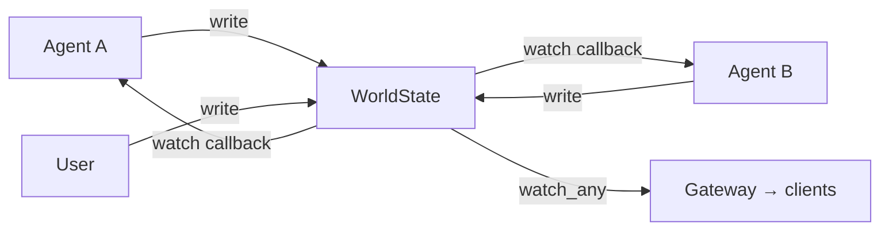
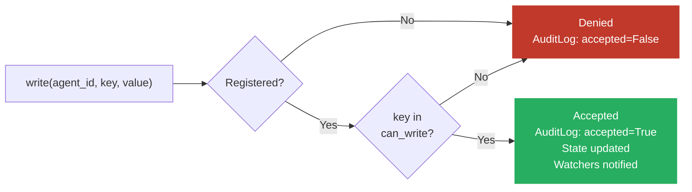
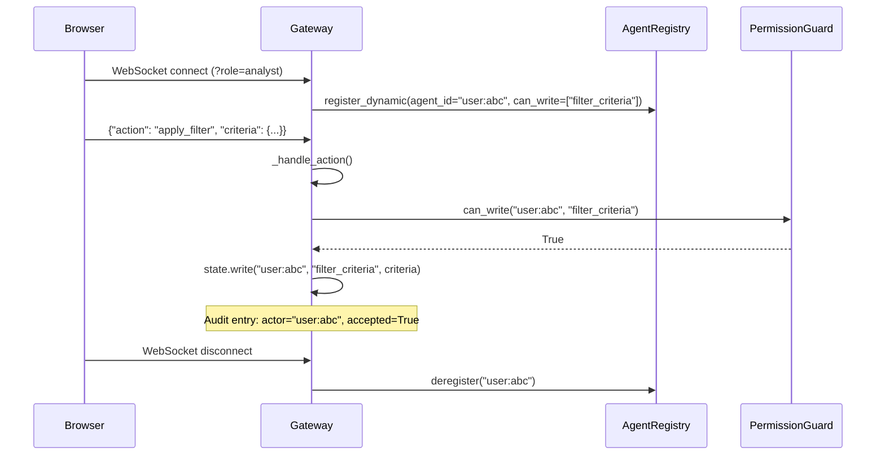

# Core Concepts

This page covers the five patterns that underpin every MIVAIS application. Reading it before writing code will make the API reference and the building guide considerably easier to follow.

---

## 1. The Shared Blackboard

All state in a MIVAIS application lives in a single `WorldState` object. Every agent and every connected user reads from and writes to this one object. Agents never hold references to each other.



This is the **blackboard pattern**: the shared artifact coordinates work, not the workers.

The consequence is that any agent can be replaced, added, or removed without touching the others. An agent that writes `result_key` does not know which other agents are watching it. An agent that watches `result_key` does not know who wrote it.

### Writing to state

```python
# Permission-checked, audit-logged
accepted = state.write(agent_id, "result_key", value)

# Bypasses permission check — only for infrastructure startup
state.system_write("dataset", records)
```

### Watching state

Agents register async callbacks in their `run()` method. The callback fires asynchronously after every accepted write to the watched key.

```python
async def run(self) -> None:
    self._ws.watch("input_key", self._on_input)
    await asyncio.get_event_loop().create_future()  # keep alive

async def _on_input(self, key: str, value: Any) -> None:
    result = compute(value)
    self._write("result_key", result)
```

### Watching multiple keys without race conditions

When an agent needs to react to writes on several keys, use an `asyncio.Queue` to serialise events. Without it, two rapid writes on different keys could trigger two concurrent handler invocations.

```python
async def run(self) -> None:
    queue: asyncio.Queue = asyncio.Queue()

    async def enqueue(key, value):
        await queue.put((key, value))

    self._ws.watch("key_a", enqueue)
    self._ws.watch("key_b", enqueue)

    while True:
        key, value = await queue.get()
        await self._process(key, value)
```

---

## 2. The Permission Model

Every `WorldState.write()` call is checked by `PermissionGuard` before it is applied. The guard reads from `AgentRegistry`, which is populated from the configuration file at startup.



**Both outcomes are logged.** A denied write produces an `AuditEntry` with `accepted=False`. There is no silent rejection.

### The asymmetric default

The permission model is deliberately asymmetric:

| Declared capability | Meaning |
|---|---|
| `can_read: []` | Read all keys (permissive default) |
| `can_write: []` | Write nothing (restrictive default) |

An agent that omits `can_read` can read everything — this is safe. An agent that omits `can_write` can write nothing — this is safe. You only need to declare what agents are actually permitted to change.

### Declaring capabilities

Capabilities are declared in the configuration file under each agent's entry:

```yaml
agent_id: scoring_agent
can_read:
- dataset
- filter_criteria
can_write:
- scores
- agent_status
```

At startup, this is loaded into an `AgentCapabilities` dataclass and registered:

```python
caps = AgentCapabilities(
    agent_id="scoring_agent",
    role="processor",
    can_read=["dataset", "filter_criteria"],
    can_write=["scores", "agent_status"],
)
registry.register(caps, agent_instance)
```

The PermissionGuard reads from the registry on every write — no code changes needed to update permissions, only config changes.

---

## 3. Reactive Agents

Agents extend `BaseAgent` and implement a single `run()` coroutine. They communicate with the rest of the system only through `WorldState` and `MessageBus` — never through direct references.

```python
from mivais import BaseAgent
import asyncio
from typing import Any

class ScoringAgent(BaseAgent):

    async def run(self) -> None:
        self._ws.watch("filter_criteria", self._on_criteria)
        await asyncio.get_event_loop().create_future()

    async def _on_criteria(self, key: str, criteria: Any) -> None:
        try:
            dataset = self._read("dataset", [])
            scores  = self._compute_scores(dataset, criteria)
            self._write("scores", scores)
        except Exception as exc:
            print(f"[{self.agent_id}] error: {exc}")
            self._write("agent_status", {"error": str(exc)})

    def _compute_scores(self, dataset, criteria):
        ...
```

`BaseAgent` provides four convenience helpers:

| Method | What it does |
|---|---|
| `self._read(key)` | Read from WorldState (no permission check) |
| `self._write(key, value)` | Write to WorldState — calls `write(self.agent_id, key, value)` |
| `self._publish(topic, payload)` | Publish on MessageBus |
| `self._subscribe(topic)` | Subscribe to MessageBus topic, routed to `on_message()` |

Agents must not call `system_write()`. They should not hold references to other agents. The only coordination mechanism is WorldState and the bus.

### Poll-driven agents

When an agent needs to produce periodic outputs rather than reacting to state changes, use a timed loop:

```python
async def run(self) -> None:
    while True:
        try:
            value = self._read("monitored_key")
            self._write("periodic_summary", summarise(value))
            await self._sleep(self.params.get("interval", 10.0))
        except asyncio.CancelledError:
            break
```

`self._sleep()` raises `asyncio.CancelledError` on shutdown, which exits the loop cleanly.

---

## 4. State vs. Events — WorldState and MessageBus

MIVAIS provides two coordination mechanisms. Knowing when to use each one is important.

**Use WorldState for persistent, queryable facts:**
- The current scores
- The most recent ranking
- The dataset
- Agent status

Any participant can read these at any time. When a new client connects, they immediately receive the current state snapshot.

**Use MessageBus for transient notifications:**
- "A new insight is ready"
- "Ranking computation completed"
- "User sent a chat message"

Bus messages are fire-and-forget. If a subscriber is not registered when a message is published, it does not receive it. Bus messages are appropriate when the content is ephemeral and does not need to survive a client reconnect.

```python
# Publishing an event — no need to store this in state
await self._publish("insight.ready", {
    "text": "Scores are well distributed.",
    "level": "info",
})

# Subscribing to an event
self._subscribe("insight.ready")

async def on_message(self, message: dict) -> None:
    if message["topic"] == "insight.ready":
        print(message["payload"]["text"])
```

All bus messages are logged in `AuditLog` with `event_type="bus_message"`, so the full communication history is preserved even though messages are not stored in state.

---

## 5. Users as Agents

Every user who connects via WebSocket is registered in `AgentRegistry` with their role's declared permissions, and given an `agent_id` of `user:<session_id>`. From the infrastructure's perspective, a human user and a software agent are the same kind of participant.



This has two important consequences:

**The AuditLog records human actions with full attribution.** In a multi-user session, the log records which specific session wrote which value, not just "a user did something."

**User permissions are enforced by the same code path as agent permissions.** There is no special case for users. An analyst with `can_write: ["filter_criteria"]` cannot write `scores` any more than an agent without that permission can.

### Reacting to state changes as a user

When any WorldState key changes, the Gateway broadcasts the updated state to all connected clients:

```javascript
ws.onmessage = (event) => {
    const msg = JSON.parse(event.data)
    if (msg.type === "state_update") {
        renderScores(msg.world_state.scores)
        renderAuditLog(msg.audit_log)
    }
}
```

This is automatic — no application code is needed to trigger the broadcast. Every accepted `WorldState.write()` fires the Gateway's `watch_any` callback.
