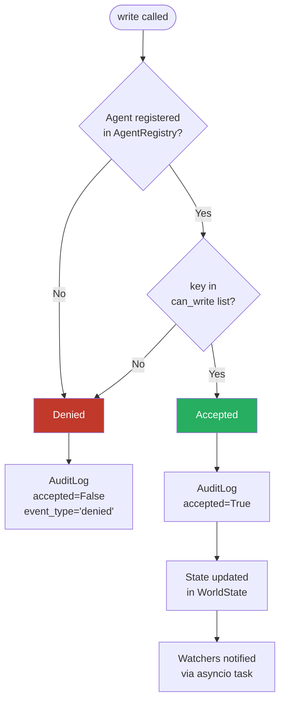
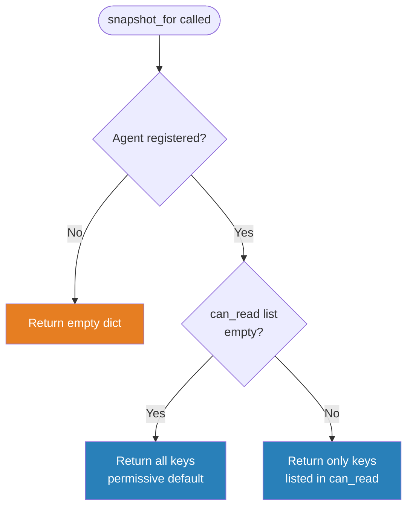
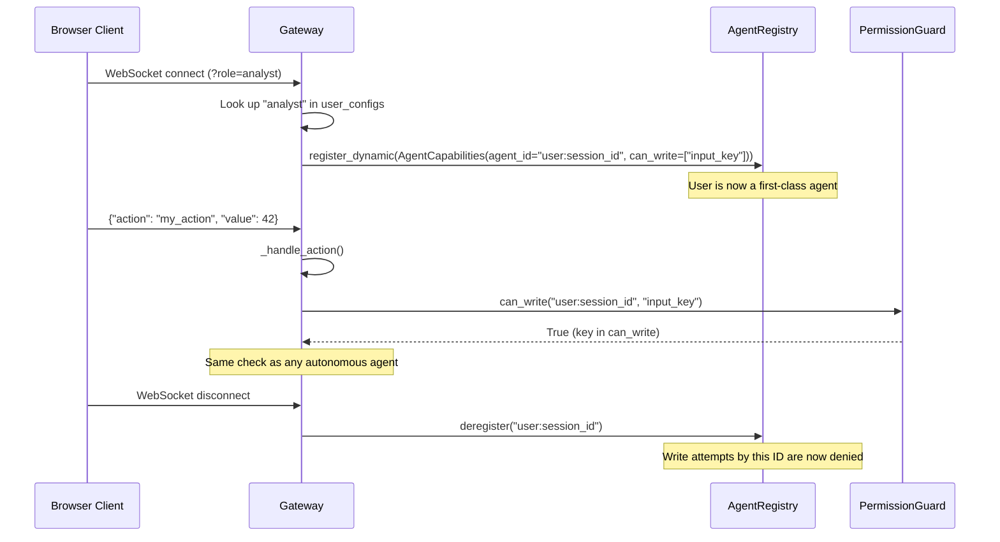

# Permission Model

MIVAIS enforces a declarative, capability-based permission model. Every participant — human user or autonomous agent — is registered in the `AgentRegistry` with an explicit `AgentCapabilities` object. The `PermissionGuard` consults the registry on every write attempt and every bus topic access.

## Write Permission Flow

Every call to `WorldState.write(agent_id, key, value)` passes through the following decision:



In both cases — accepted or denied — an `AuditEntry` is written. There is no silent failure.

## Read Permission Flow

`WorldState.get(key)` has **no permission check**. It is available to any code with a reference to the WorldState object. Permission filtering is applied when creating per-agent views:



::: info
The permissive read default reflects the reality that agents need to compute on data. Restricting snapshot visibility is opt-in and primarily affects what is transmitted over the network to clients — not what agent code can access.
:::

## Asymmetric Defaults

The defaults are deliberately asymmetric:

| Condition | Effect | Rationale |
|---|---|---|
| `can_read: []` | Read all keys | Reading is generally harmless |
| `can_write: []` | Write nothing | Write access is the security boundary |
| `bus_publish_topics: []` | Publish on all topics | Agent code is trusted |
| `bus_subscribe_topics: []` | No topics forwarded via Gateway | Clients subscribe explicitly |

The key insight: an agent that accidentally gains write access to the wrong key can corrupt shared state. An agent that reads more than intended cannot.

## The User-as-Agent Pattern

When a user connects via WebSocket, the Gateway registers them as a full agent:



Human actions go through the same `PermissionGuard` as autonomous agents. There is no privileged side channel for users.

## Core Rules

### WorldState writes

1. If the agent is not registered → **denied**.
2. If `can_write` is empty → **denied** (restrictive default).
3. If `key` is in `can_write` → **accepted**.

### WorldState reads

`WorldState.get(key)` has no guard. Permission filtering is applied only in `snapshot_for(agent_id)`.

### MessageBus publish

`MessageBus.publish()` itself has no guard. Restrictions are enforced at the **Gateway level**: the Gateway checks `can_publish()` before forwarding a user-initiated `publish_bus` WebSocket action to the bus.

### MessageBus subscribe

`bus.subscribe()` has no guard. Restrictions are enforced in the Gateway when deciding which topics to forward to connected user clients via WebSocket.

## system_write

`WorldState.system_write(key, value)` bypasses `PermissionGuard` entirely. It is intended exclusively for infrastructure-level writes at startup and for Gateway internals. It is always logged with `actor="system"`.

Do not call `system_write` from agent code.

## Topology Visibility

The `AgentRegistry.summary()` method returns a JSON-serialisable list of all registered agents and their declared capabilities. Expose it as a REST endpoint to power topology visualisations:

```python
@app.get("/agents")
def get_agents():
    return registry.summary()
```

A topology view that renders the permission graph — which agents can read and write which keys, and which topics connect them — gives administrators a real-time picture of the system's data flows and access boundaries.
